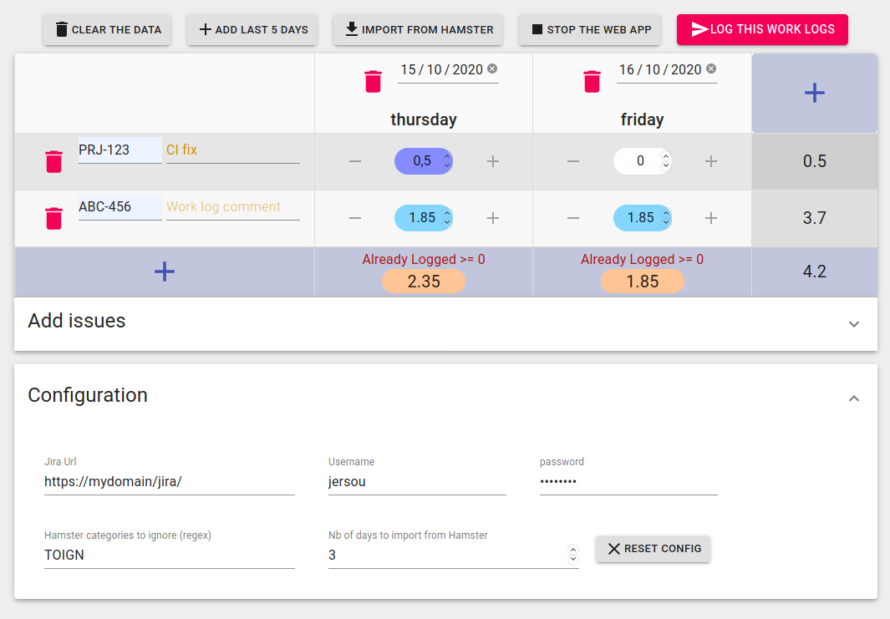

# Jira-Work-Logger

A web app to easily add Jira worklogs (and to make a standalone [Deno](https://deno.land/)/[React](https://www.reactjs.org/) WebApp POC).


## To run the WebApp :
First, you need deno : https://deno.land/#installation

The whole application is encapsulated in a single file, and could simply run with : 
```
deno run --unstable --allow-net --allow-run https://raw.githubusercontent.com/jersou/jira-work-logger/main/dist/server.js --wait-and-close
```
Then, go to [http://localhost:8000/](http://localhost:8000/) with a web browser (this page open at app start-up if you use the `--allow-run` parameter).

Then, set the configuration in the bottom part to get Jira Issues and add worklogs.

The `--allow-run` parameter can be skipped if you don't use [Hamster](https://github.com/projecthamster/hamster) and if you don't want the application to open in the default browser on startup.

If the script parameter `--wait-and-close` is present, the server will wait a frontend connection and it will stop by itself as soon as the frontend is closed (a websocket is check every 4 secondes).

## Install (by Deno)
```
deno install --name jira-work-logger  --unstable --allow-net --allow-run https://raw.githubusercontent.com/jersou/jira-work-logger/main/dist/server.js --wait-and-close
```
Then, simply run `jira-work-logger`

## Permissions

* `--unstable`  : permission check
* `--allow-net` : to serve HTTP, send request to Jira server, and run Websocket (if --wait-and-close). You can adjust this permission: `--allow-net=127.0.0.1:8000,0.0.0.0:8001,my.own.domain.jira`
* `--allow-run` (optional) : to open the frontend in the default web browser and call [Hamster](https://github.com/projecthamster/hamster) on "Import from Hamster" button click, this feature use [Deno-Opn](https://github.com/hashrock/deno-opn)

## To update the WebApp :
Once run one time, the app is cached by Deno, to update the app :
```
deno cache --reload --unstable https://raw.githubusercontent.com/jersou/jira-work-logger/main/dist/server.js
```
or add the `--reload` parameter to the run command

## Screenshot


## Dependencies

* [Deno](https://deno.land/)
  * [Oak](https://oakserver.github.io/oak/)
  * [Deno-Opn](https://github.com/hashrock/deno-opn)
* [React](https://www.reactjs.org/)
  * [Create React App](https://reactjs.org/docs/create-a-new-react-app.html)
  * [Material UI](https://material-ui.com/)
  * [React Transition Group](https://github.com/reactjs/react-transition-group)
* [Redux](https://redux.js.org/)
  * [Reduxjs Toolkit](https://redux-toolkit.js.org/)
  * [React Redux](https://react-redux.js.org/)
  * [Immer](https://immerjs.github.io/immer/docs/introduction)
* [Dayjs](https://github.com/iamkun/dayjs)
* [Storybook](https://storybook.js.org/)
* [Typescript](https://www.typescriptlang.org/)
* [Prettier](https://prettier.io/)
* [Scss](https://sass-lang.com/)

# Make the bundle file
```
git clone https://github.com/jersou/jira-work-logger.git
cd jira-work-logger/frontend
yarn install
yarn build
cd ..
deno run --unstable --allow-read --allow-write ./filesContentGenerator.ts
deno bundle --unstable ./server.ts dist/server.js
deno run --unstable --allow-net --allow-run dist/server.js
```
